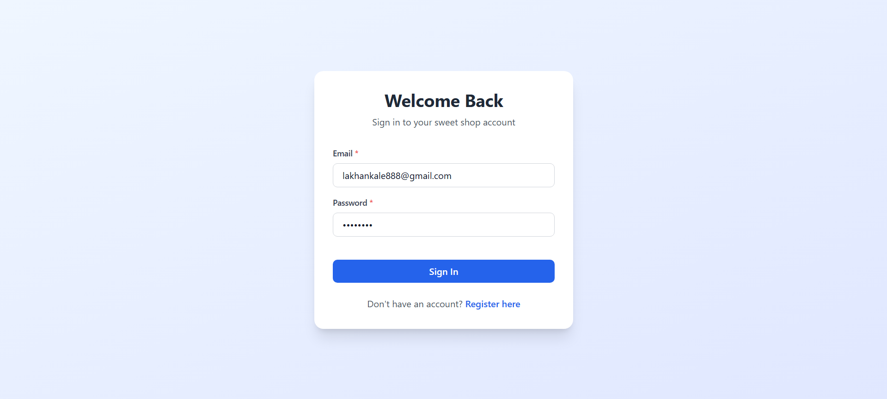
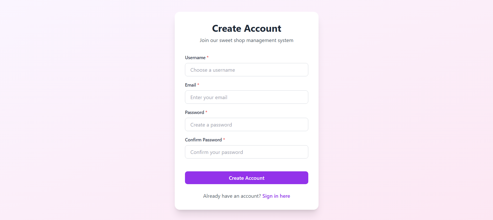
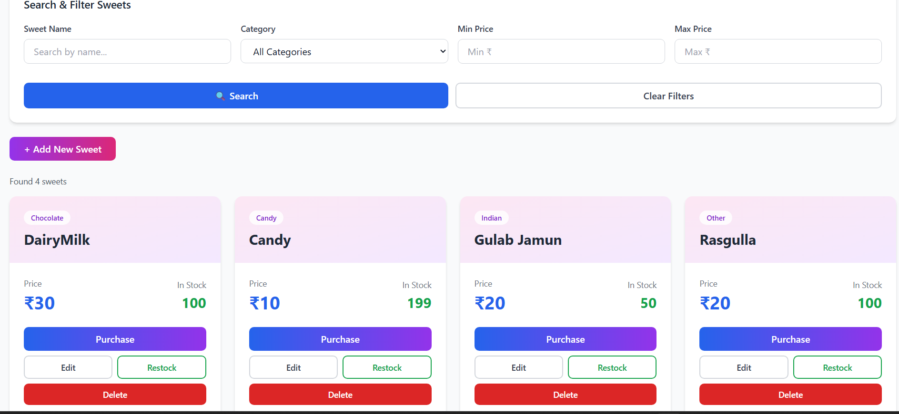
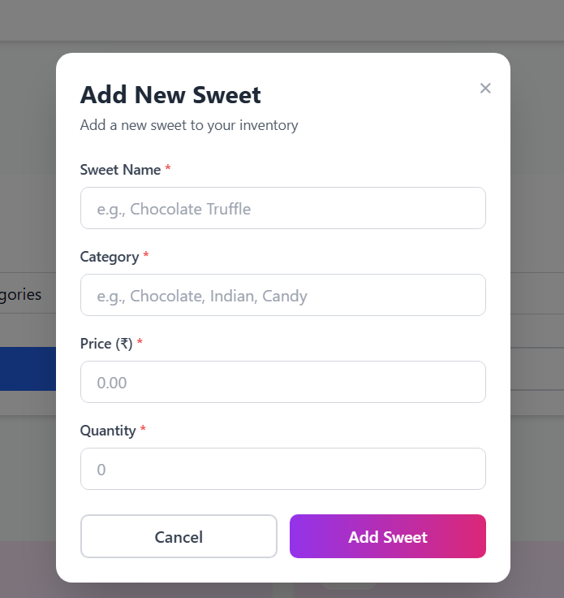
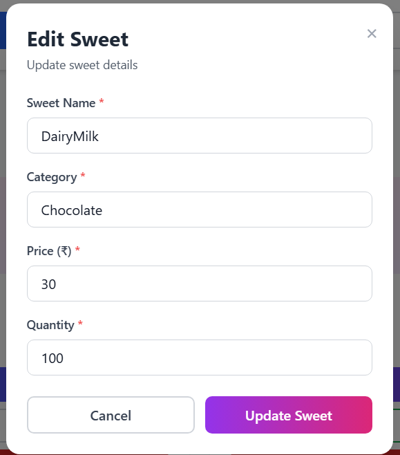
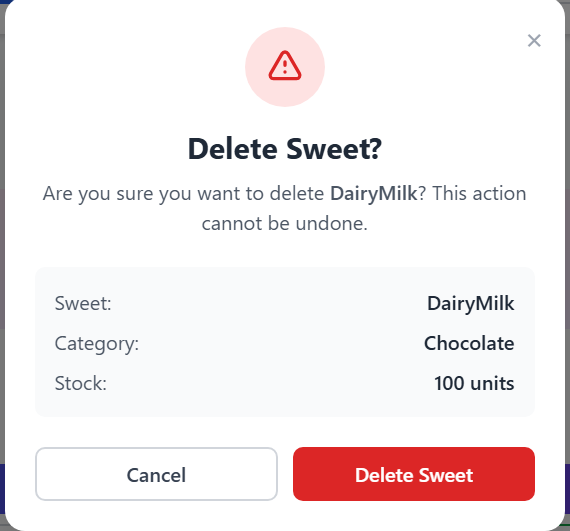
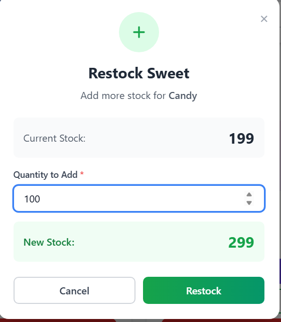

# 🍬 Sweet Shop Management System

A full-stack sweet shop management application with Spring Boot backend and React frontend, featuring JWT authentication and complete inventory management.

## 🎯 Features

- User authentication (Register/Login with JWT)
- Sweet CRUD operations (Create, Read, Update, Delete)
- Search & filter by name, category, price
- Purchase system with inventory updates
- Restock functionality
- Responsive design

## 🛠️ Tech Stack

**Backend:** Java 17, Spring Boot, Spring Security, MySQL, Maven  
**Frontend:** React 18, Vite, Tailwind CSS, Axios, React Router

## 🚀 Quick Start

### Backend
```bash
# Create database
CREATE DATABASE sweet_shop_db;

# Update backend/src/main/resources/application.properties
spring.datasource.url=jdbc:mysql://localhost:3306/sweet_shop_db
spring.datasource.username=your_username
spring.datasource.password=your_password
jwt.secret=your-secret-key

# Run
cd backend
mvn clean install
mvn spring-boot:run
```

### Frontend
```bash
cd frontend
npm install
npm run dev
```

Access at: `http://localhost:5173`

## 📸 Screenshots

<table>
  <tr>
    <td><br/><b>Login</b></td>
    <td><br/><b>Register</b></td>
  </tr>
  <tr>
    <td><br/><b>Dashboard</b></td>
    <td><br/><b>Search & Filter</b></td>
  </tr>
  <tr>
    <td><br/><b>Add Sweet</b></td>
    <td><br/><b>Edit Sweet</b></td>
  </tr>
  <tr>
    <td><br/><b>Delete</b></td>
    <td><br/><b>Restock</b></td>
  </tr>
</table>

## 🧪 Testing

```bash
cd backend
mvn test                    # Run tests
mvn test jacoco:report      # Generate coverage report
```

**Coverage:** 88%+ (Controllers: 85%+, Services: 90%+, Repositories: 95%+)

## 🤖 My AI Usage

### Tool Used
**Gemini AI (Google)** - Used throughout development

### How I Used AI

**Architecture & Planning**
- AI suggested RESTful API structure and component architecture
- I reviewed, made decisions, and adapted to requirements

**Backend Development**
- AI generated Spring Boot boilerplate, JWT setup, test cases
- I customized business logic, configured database, refined tests

**Frontend Development**
- AI created React components, styling, routing
- I designed UI/UX, integrated APIs, handled edge cases

**Debugging**
- AI identified CORS issues, port mismatches, auth problems
- I tested solutions and verified fixes

**Documentation**
- AI generated commit messages and README structure
- I added project details and organized content

### Impact

**Positives:**
- 3-4x faster development
- Learned new patterns
- Better error handling
- Quick documentation

**Challenges:**
- Always validated AI suggestions
- Ensured I understood all code
- Required thorough testing
- Needed customization

### Reflection

AI was a development partner, not a replacement. I remained the architect and decision-maker, using AI to:
- Handle repetitive tasks
- Suggest solutions
- Generate boilerplate
- Speed up documentation

Key principle: **Critical thinking over blind acceptance**

### Transparency
All commits include: `Co-authored-by: Gemini AI <gemini@users.noreply.github.com>`

##  Structure

```
sweet-shop-management-system/
├── backend/          # Spring Boot API
│   └── src/
│       ├── main/java/com/lucky/backend/
│       └── test/
├── frontend/         # React SPA
│   └── src/
│       ├── components/
│       ├── pages/
│       └── api/
└── screenshots/
```

## 👥 Contributors

**Laxman Kale** - Developer  
**Gemini AI** - AI Assistant

---

**Built with Spring Boot, React, and AI assistance**
